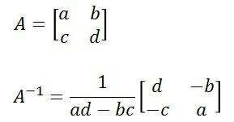

# 오늘의 정리  
  
map() 메소드나 replace() 메소드를 사용하면 범주형 값을 다른 값으로 쉽게 변경 가능  
ex) df['col1']=df['col1'].map({'a':1, 'b':2})  
    df['col1']=df['col1'].replace({'a':1, 'b':2})  
        
map은 데이터프레임 전체에 활용가능, mapping이 안되면 NaN값으로 나온다.    
replace는 열에 한정해서만 사용가능, mapping이 안되면 안되는건 그대로 둔다.   

이산화: 연속값을 구간을 나눠 범주값으로 표현하는 과정.  
```python
print(type(pd.cut(list(range(21)), 4, ['a','b','c','d'])))
#<class 'pandas.core.arrays.categorical.Categorical'>
# tip 크기를 기준으로 4구간(a ~ d)으로 나누기
pd.cut(list(range(21)), 4, ['a','b','c','d'])
"""[(-0.02, 5.0], (-0.02, 5.0], (-0.02, 5.0], (-0.02, 5.0], (-0.02, 5.0], ..., (15.0, 20.0], (15.0, 20.0], (15.0, 20.0], (15.0, 20.0], (15.0, 20.0]]
Length: 21
Categories (4, interval[float64, right]): [(-0.02, 5.0] < (5.0, 10.0] < (10.0, 15.0] < (15.0, 20.0]]"""
#(초과 이하] 
```
  
cut()함수를 사용해 크기를 기준으로 구간을 나눌 수 있다.    
```python
tip['tip'].min()
#최소값은 1인데 cut의 앞부분은 초과로 조건을 걸기 때문에 1을 포함하기 위해 0.991로 범위 시작을 잡음 
print(pd.cut(tip['tip'],4,['a','b','c','d']) )
#labels=을 생략하면 분류된 값으로 나오지 않으므로 명시해줘야함.

pd.cut(tip['tip'],4,labels=['a','b','c','d']) 
```  
구간별 평균 나누기  
ex) tip.groupby('bill_grp2', as_index=False)[['total_bill', 'tip']].mean()  
  
droppna() 메소드로 결측치가 있는 열이나 행을 제거할 수 있다.   

fillna() 메소드를 사용해 결측치를 다른 값으로 채울 수 있다.  
날짜 또는 시간의 흐름에 따른 값을 갖는 시계열 데이터 처리시 유용.  
method='ffill': 바로 앞의 값으로 변경(Fowared Fill)  
method='bfill': 바로 다음 값으로 변경(Backwared Fill)  

선형보간법  
air_test.interpolate(method='linear')  
interoperate 함수로 보간법을 적용하여 linear(선형보정) quadratic(부드러운 보정) 두가지 방법으로 만든다.  
 fl = interp1d(x,y,kind = 'linear')  
 fq = interp1d(x,y,kind = 'quadratic')  

 xint = np.linspace(x.min(), x.max(), 1000)  

 #참조  
 https://sdc-james.gitbook.io/onebook/4.-numpy-and-scipy/4.3-scipy/4.3.1.-interpolation    

가변수 : 일정하게 정해진 범위의 값을 갖는 데이터(범주형 데이터)를 독립된 열로 변환한 것으로 원핫인코딩이라고도 한다. get_dummies() 함수 사용.  

다중공선성 문제를 없애기 위해 drop_first=True 옵션 지정한다.    
drop_first는 가변수화로 나온 열들 중에서 하나의 열을 날린다.  

원핫 인코딩된 데이터를 사용할 때는 다중 공선성(mulicollinearity)를 생각해야한다. 역행렬을 구해야하는 경우에는 문제가 될 수 있기 때문이다.  
특성간 상관관계가 높으면 역행렬을 계산하기 힘들어 수치적 불안정성이 높아진다. 이 상관관계를 감소시키기 위해 인코딩된 배열의 열 하나를 삭제한다. 만약 color_blue를 삭제해도 color_green은 0이고 color_red가 0이면 blue가 1임을 알 수 있으므로 데이터에는 손실이 없다.  
  
어떤 행렬 A와 곱했을 때 곱셈에 대한 항등원인 단위행렬 E가 나오게 하는 행렬을 행렬 A의 역행렬이라고 한다. 행렬 A의 역행렬은 기호로 A-1라고 쓰고 A inverse(A 인버스)라고 읽음. 역원을 숫자에서는 역수, 행렬에서는 역행렬이라고 읽는다.  
  
  
  
집합s의 임의의 원소 a와 원소e를 연산한 결과가 a가 될 때 e를 연산에 대한 항등원이라고 한다. 쉽게 말하면 자기자신이 되게하는 수다.  
#참조 https://dnai-deny.tistory.com/12    
  
가변수화 한 다음에 하나는 빼도 된다.  
가변수화를 적용한 결과의 성능은 해봐야 알고 안한게 더 좋을 수도 있다. 그러므로 가변화적용도 미적용도 다 해봐야 한다.      
 
# 다중공선성을 반드시 제거해야하는것은 아님 정답은 없다.     
# 몇몇 머신러닝 알고리즘에서 다중공선성 문제를 해결했을 때 성능이 좋았기 때문에 가변수화를 권고한 것이다.   
  
concat()함수를 사용하면 인덱스 값을 기준으로 두 데이터프레임을 가로 또는 세로로 합칠 수 있다. axis=1이 가로  
ex)pop = pd.concat([pop01, pop02], axis=1, join='outer')  

join='inner' 옵션을 지정하면 매핑되지 못한 행은 제외된다.  

concat후 NAN값이 나올 수도 있다.     
inner는 int값이 나왔지만 outer는 실수값이 나오는 이유는 NaN값이 존재해서 NaN값은 float가 나올 수 있다. 따라서 정수도 실수로 표현될 수 있다.  

#만약 문자열과 float이 만나면 문자열로 나올것임.  

merge()함수를 사용해 두 데이터 프레임을 지정한 키 값을 기준으로 병합할 수 있다.  
merge는 두개의 데이터씩만 합칠 수 있다.   
인덱스랑 상관없이 키 값을 기준으로 한다.  
  
# 이런식으로 merge는 두개씩만 사용가능하다.   
ex) pop = pd.merge(n1, n2, on='?', how='outer')  
  
inner 조인  
같은 이름의 열이 있으면 on 옵션을 지정하지 않아도 그 열을 기준으로 조인된다. 그래도 기준 열을 명시적으로 지정하는게 좋다.   
how='inner' 옵션은 기본 옵션값이므로 생략할 수 있다.  

#left 조인: 왼쪽 df를 기준으로 오른쪽 df를 병합하는 방법이다. 값이 없으면 NAN으로 채워진다.   
#right  
#outer  
#inner  
